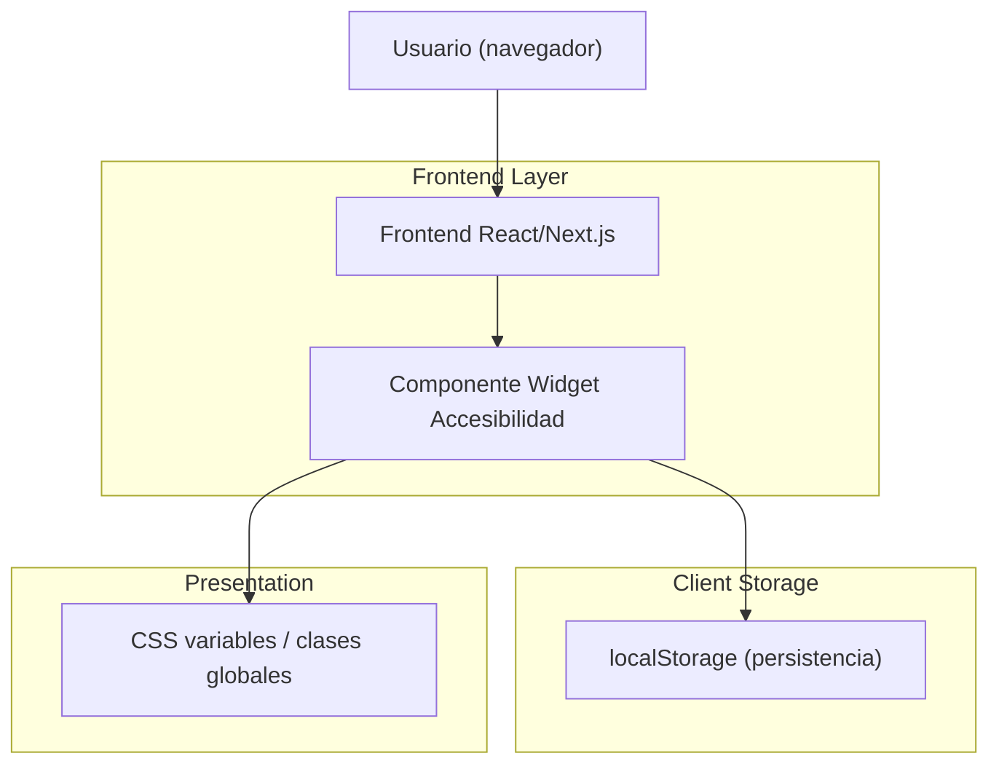

## 1.Architecture design

## 2.Technology Description
- Frontend: React@18 + Next.js (App Router) + TypeScript + tailwindcss@3
- Backend: None (no requerido para ajustes de accesibilidad y persistencia local)

## 3.Route definitions
El widget se inyecta de forma global (layout), sin crear rutas nuevas.

| Route | Purpose |
|-------|---------|
| / | Página principal del sitio (con widget global) |
| /login | Acceso (si existe en el sitio) + widget global |
| /antes-de-ir | Página informativa + widget global |
| /recomendar | Página de recomendación + widget global |
| /resultados | Página de resultados + widget global |
| /tracking | Página de seguimiento + widget global |
| /chat/[visitaId] | Página de chat + widget global |

## 4.API definitions (If it includes backend services)
No aplica: no se agregan servicios backend.

## 6.Data model(if applicable)
No aplica: el estado es local y persistente en el cliente (localStorage).

### Notas de implementación (criterios técnicos)
- Mantener la estructura del HTML dado: el componente React renderiza el mismo árbol/IDs/clases para evitar regresiones visuales.
- Estado del widget: modelo único (p. ej. `AccessibilityState`) con valores por defecto.
- Persistencia: lectura al montar (SSR-safe), escritura por cambios; versionar el schema (p. ej. `accessibility:v1`).
- Aplicación de estilos: preferir CSS variables/clases en `html`/`body` (p. ej. `data-a11y-contrast="high"`) para afectar toda la UI sin modificar componentes individuales.
- Accesibilidad del panel: si el menú se comporta como “diálogo”, usar foco controlado (focus trap), `aria-expanded`, `aria-controls`, y cierre por `Esc`.