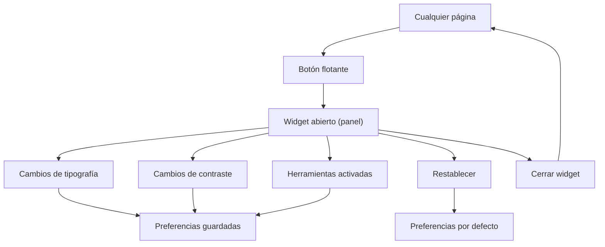

## 1. Product Overview
Widget de accesibilidad tipo “menú flotante” integrado en todas las páginas, basado en el HTML proporcionado.
Permite ajustar tipografía/contraste y activar herramientas de lectura, con estado persistente entre sesiones.

## 2. Core Features

### 2.1 User Roles
No aplica: cualquier visitante puede usar el widget sin registro.

### 2.2 Feature Module
1. **Todas las páginas (sitio existente)**: renderizar el contenido habitual + incluir el widget flotante global.
2. **Widget de accesibilidad (menú flotante)**: botón flotante para abrir/cerrar, panel con secciones (Tipografía, Contraste, Herramientas), restablecer y persistencia.

### 2.3 Page Details
| Page Name | Module Name | Feature description |
|-----------|-------------|---------------------|
| Todas las páginas (sitio existente) | Inyección global del widget | Renderizar el HTML del widget en layout global, manteniendo la estructura/clases del HTML dado. |
| Todas las páginas (sitio existente) | Botón flotante | Abrir/cerrar el panel del menú desde un botón fijo (overlay) con label accesible y foco visible. |
| Todas las páginas (sitio existente) | Panel/Menú (contenedor) | Mostrar/ocultar un panel flotante con cierre explícito y por tecla (Esc); evitar bloquear el contenido principal más de lo necesario. |
| Todas las páginas (sitio existente) | Tipografía | Ajustar tamaño de texto (incrementar/decrementar y/o selector), interlineado/espaciado (si existe en el HTML), y aplicar cambios a todo el documento con límites razonables. |
| Todas las páginas (sitio existente) | Contraste | Alternar modos de contraste (p. ej. alto contraste, invertir, modo oscuro/claridad) según opciones presentes en el HTML; reflejar estado activado/desactivado. |
| Todas las páginas (sitio existente) | Herramientas de lectura | Activar/desactivar utilidades del HTML (p. ej. resaltar enlaces, subrayar títulos, escala de grises, ocultar imágenes, pausar animaciones u otras). |
| Todas las páginas (sitio existente) | Persistencia de estado | Guardar preferencias (tipografía/contraste/herramientas y estado abierto/cerrado si aplica) y restaurarlas al cargar páginas y al navegar. |
| Todas las páginas (sitio existente) | Restablecer | Volver a valores por defecto con un botón “Restablecer” (según el HTML), limpiando almacenamiento persistente. |
| Todas las páginas (sitio existente) | Accesibilidad del propio widget | Soportar navegación por teclado (Tab/Shift+Tab), roles/ARIA correctos, foco atrapado cuando el panel esté abierto (si actúa como diálogo), y compatibilidad con lectores de pantalla. |

## 3. Core Process
- Flujo de uso (visitante):
  1) En cualquier página, pulsas el botón flotante de accesibilidad.
  2) Se abre el panel del menú con secciones Tipografía/Contraste/Herramientas.
  3) Activar/desactivar opciones actualiza inmediatamente la UI del sitio.
  4) Tus preferencias se guardan automáticamente y se restauran en futuras visitas.
  5) Si necesitas volver atrás, usas “Restablecer” para retornar a valores por defecto.

